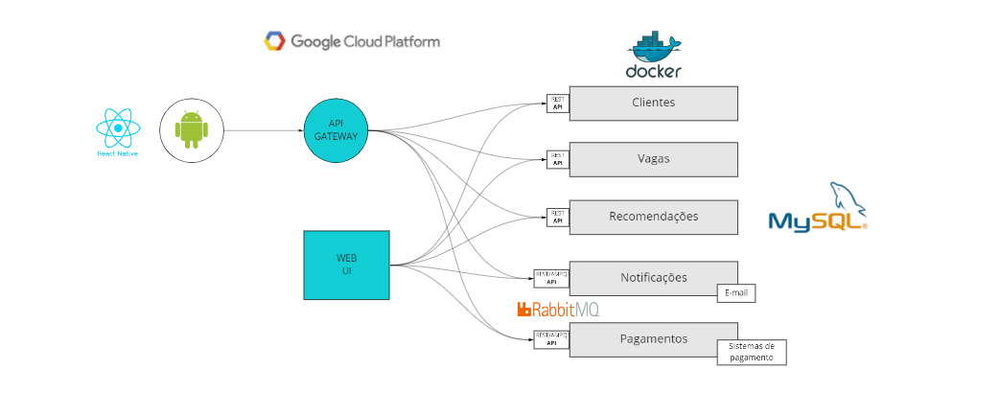

# Admite-se!

Este é o repositório dos códigos das API's do Projeto Integrador V, do Curso de **Análise e Desenvolvimento de Sistemas** do **Centro Universitário Newton Paiva**, aplicativo **_Admite-se!_**.

## Grupo composto por:

- Adelvan Lima
- Antônio Junio
- Valdemir
- Paulo
- Sarah Araújo

## Arquitetura Proposta

Neste projeto, iremos implementar a seguinte arquitetura:

## Instalação e configuração do projeto

**1 passo:** instalar o git na maquina

**2 passo:** clonar repositorio: git clone

**3 passo:** baixar o docker desktop: https://docs.docker.com/desktop/windows/install/

**4 passo:** entrar no diretorio que foi clonado e abrir o terminal no caminho do diretorio e digitar: docker-compose up -d

**5 passo:** conferir se as imagens esta listada no app do docker desktop

**6 passo:** voltar ao terminal e digitar docker-compose run.

**Observação:** _caso use Windows Home será necessário instalar o WSL2._
